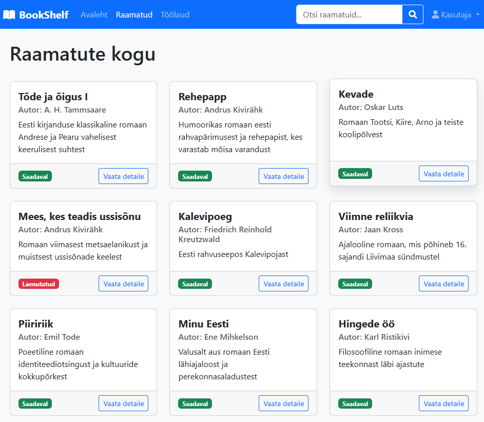

# BookShelf - Library Management System


[](https://www.php.net)
[](https://www.mysql.com)
[](https://getbootstrap.com)

A web-based library management system that allows users to browse books, borrow them, and track their reading journey. Built with PHP, MySQL, and Bootstrap.



## 📚 Features

- **User Authentication System**
  - Secure login and registration
  - Password hashing using bcrypt
  - Session management

- **Book Management**
  - Browse available books
  - Search by title, author, or description
  - View detailed information about books

- **Borrowing System**
  - Borrow available books
  - Keep track of due dates
  - Return borrowed books

- **User Dashboard**
  - View borrowed books
  - Manage profile information
  - Change password securely

- **Admin Features**
  - Add new books to the collection
  - Edit existing book information
  - Delete books from the system
  - Delete users from the system

## 🚀 Installation

### Prerequisites
- PHP 7.4 or higher
- MySQL 5.7 or higher
- Web server (Apache/Nginx)
- [XAMPP](https://www.apachefriends.org/download.html) (recommended for local development)

### Setup Instructions

1. **Clone the repository**
   ```bash
   git clone https://github.com/Artjomeller/bookshelf.git
   ```

2. **Create the database**
   - Open phpMyAdmin (`http://localhost/phpmyadmin`)
   - Create a new database named `bookshelf_db`
   - Import the `bookshelf_db.txt` file from the project

3. **Configure database connection**
   - Open `config/database.php`
   - Update the database credentials if necessary:
     ```php
     $host = 'localhost';
     $db_name = 'bookshelf_db';
     $username = 'root'; // Change if needed
     $password = ''; // Change if needed
     ```

4. **Start your web server**
   - If using XAMPP, start Apache and MySQL

5. **Access the application**
   - Open your web browser and navigate to:
   - `http://localhost/bookshelf/`

## 🔐 Default Login Credentials

Use these credentials to test the application:

**Admin User**
- Username: `admin`
- Password: `Parool11`

**Regular User**
- Username: `Kasutaja`
- Password: `Parool12`

## 🛠️ Technologies Used

- **Frontend**
  - HTML5
  - CSS3
  - JavaScript
  - Bootstrap 5.3
  - Font Awesome 6.0

- **Backend**
  - PHP 8
  - MySQL

- **Security**
  - Password hashing (bcrypt)
  - PDO prepared statements
  - XSS protection
  - CSRF protection
  - Session security

## 📋 Future Enhancements

- Email notifications for due dates
- Book reservation system
- Book rating and review system
- User roles (librarian, member)
- Advanced reporting and statistics

## 📝 License

This project is educational software and is available under the MIT License.

## 👨‍💻 Author

- **Artjom Eller** - [GitHub Profile](https://github.com/Artjomeller)

---

This project was created as a learning exercise for web development using PHP and MySQL.
